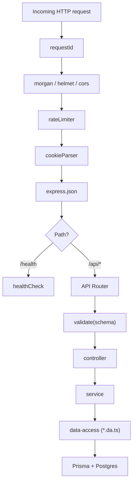

# Request Lifecycle

Order of middleware as wired in [server/src/app.ts:14](../../../server/src/app.ts):

1. `app.set('trust proxy', 1)` — needed for [[Rate Limiter]] behind a proxy
2. [[requestId]] — generates a cuid, sets `req.id` and `X-Request-Id` response header
3. `morgan('dev')` — request logger
4. `helmet()` — security headers
5. `cors({ origin: env.CORS_ORIGIN, credentials: true })` — see [[Client-Server Boundary]]
6. [[Rate Limiter]] — global limit, applies before any route
7. `cookieParser()` — parses incoming `Cookie` header into `req.cookies`
8. `express.json()` — JSON body parser
9. **`GET /health`** → [[healthCheck]] (public, before auth)
10. **`/api/*`** → [[API Router]]
11. [[notFound]] — unmatched routes
12. [[errorHandler]] — terminal error sink

> [!info] Per-route validation pattern
> Routes are expected to call [[validate]] with a Zod schema, but no `/api` routes exist yet to demonstrate it.
