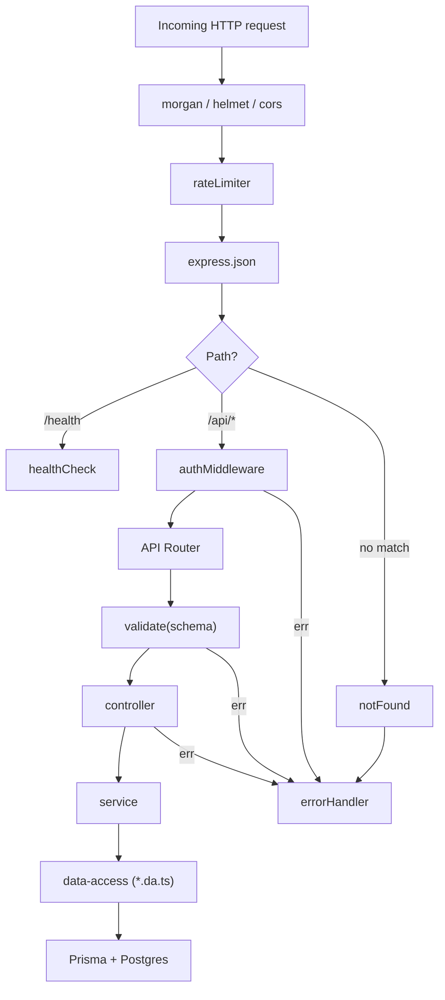

# Request Lifecycle

Order of middleware as wired in [server/src/app.ts:14](../../../server/src/app.ts):

1. `morgan('dev')` — request logger
2. `helmet()` — security headers
3. `app.set('trust proxy', 1)` — needed for [[Rate Limiter]] behind a proxy
4. `cors(...)` — see [[Client-Server Boundary]] for origin policy
5. [[Rate Limiter]] — global limit, applies before any route
6. `express.json()` — JSON body parser
7. **`GET /health`** → [[healthCheck]] (public, before auth)
8. **`/api/*`** → [[authMiddleware]] → [[API Router]]
9. [[notFound]] — unmatched routes
10. [[errorHandler]] — terminal error sink

> [!info] Per-route validation pattern
> Routes are expected to call [[validate]] with a Zod schema, but no `/api` routes exist yet to demonstrate it.
