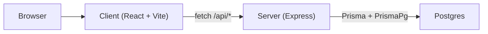

# System Overview

Clearance is a fullstack monorepo with two git submodules and a shared docs/vault.

## Pieces

- **[[Client MOC|Client]]** — React 19 SPA, Vite dev server, Tailwind v4, shadcn/ui.
- **[[Server MOC|Server]]** — Express 5 API, Prisma 7, Winston logging, Helmet/CORS/rate-limit hardening.
- **[[Prisma]] + Postgres** — persistence; data layer not yet populated.

## Boundary

The seam between the two halves is documented in [[Client-Server Boundary]] and detailed per-endpoint in [[_API Index]].

## Repo layout

- `client/` — submodule, see [[Client MOC]]
- `server/` — submodule, see [[Server MOC]]
- `docs/vault/` — this knowledge graph
- Root [CLAUDE.md](../../../CLAUDE.md) — shared conventions
