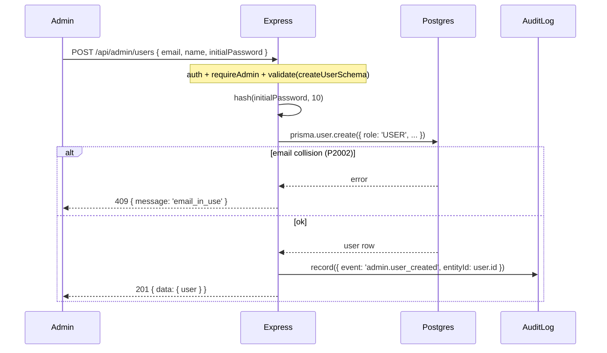

# Admin Creates User

## Invariants enforced at the service layer
- Body schema is `z.strictObject(...)` — any extra field (e.g. `role`) 400s in validate middleware.
- Service hard-codes `role: 'USER'`; there is no API surface to create an `ADMIN` via this path.
- Email conflict 409 surfaces via Prisma error code `P2002`.
